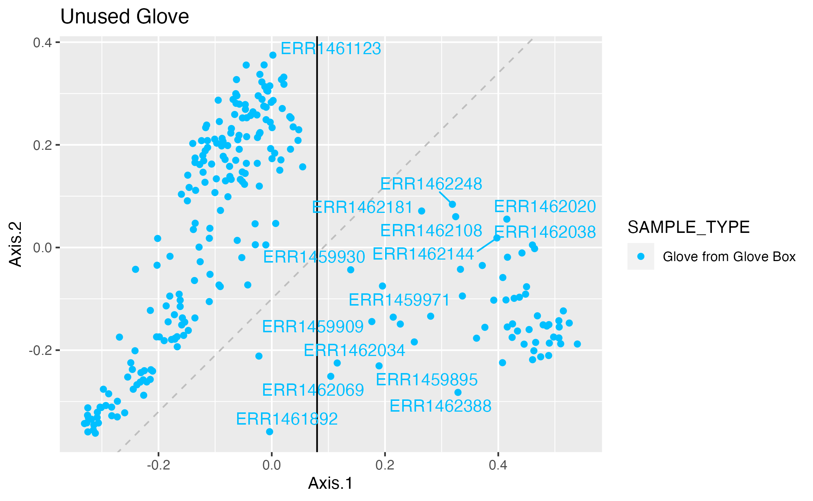

```{r setup, include=FALSE}
knitr::opts_chunk$set(echo = TRUE)
```

# Chicago Hospital Project

This uses data from....

link to publication...

link to pdf describing project...

## We have...

Where to get counts files...

How were they generated...

This includes 3k samples out of 6k.

Patient mapping available on request within PreMiEr. Day of stay info...

## Analyses

### Hand vs Bedrail on day 1 vs day 2

This waas the subject of Nico's REU poster in summer 2023.

link...

### Gloves

This analysis looks at the "gloves from glovebox" samples.



See [deep dive on unused gloves][gloves]. 


At the bottom of the document:

[gloves]: markdown-htmls/Gloves.html "Title"
